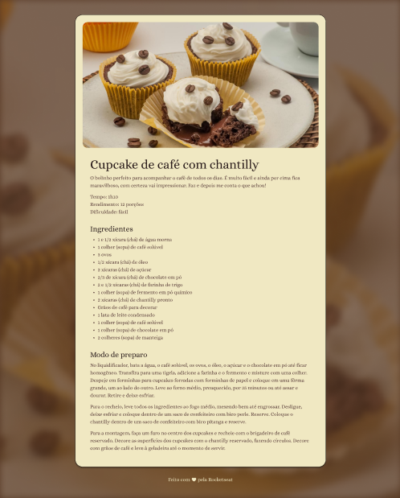

<h1 align="center"> Pagina de Receitas </h1>

<a href="https://debstd22.github.io/Pagina-de-Receitas/">Acesse o projeto finalizado clicando aqui</a>

   <a href="#objetivo-do-projeto">Objetivo do Projeto</a>&nbsp;&nbsp;&nbsp;|&nbsp;&nbsp;&nbsp;
   <a href="#tecnologias-utilizadas">Tecnologias Utilizadas</a>&nbsp;&nbsp;&nbsp;|&nbsp;&nbsp;&nbsp;
   <a href="#funcionalidades">Funcionalidades</a>&nbsp;&nbsp;&nbsp;|&nbsp;&nbsp;&nbsp;
   <a href="#layout">Layout</a>&nbsp;&nbsp;&nbsp;

&nbsp;

&nbsp;

## Objetivo do Projeto

Este projeto foi desenvolvido com o objetivo de colocar em prática os conhecimentos adquiridos no módulo de **Fundamentos de HTML e CSS** da formação Full-Stack da Rocketseat.
A proposta foi construir uma página simples, estruturada e estilizada, focando na organização do conteúdo e na aplicação de boas práticas de marcação e estilização.

## Tecnologias Utilizadas

* HTML5
* CSS3

## Funcionalidades

* Estruturação semântica de uma página de receitas
* Exibição de receita com título, ingredientes e modo de preparo
* Estilização da página com CSS
* Organização visual para melhor leitura e experiência do usuário

## Layout

Você pode visualizar o layout do projeto <a href="https://www.figma.com/design/oGkbsim6NuC4gy0coJc5z1/P%C3%A1gina-de-receita--Community---Copy-?node-id=0-1&p=f&t=7dsup8XhXueWLGTp-0">CLICANDO AQUI</a>. É necessário ter conta do <a href="https://www.figma.com/login?is_not_gen_0=true">FIGMA</a> para acessá-lo.
